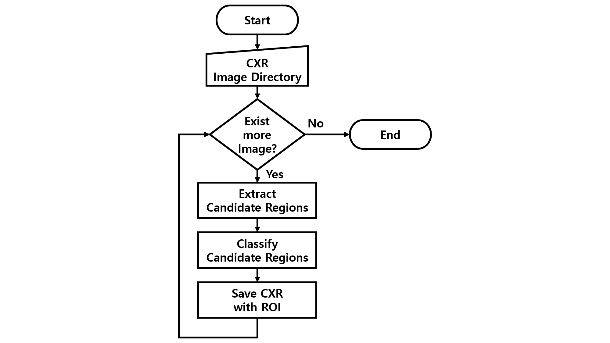

<h1>Lung Extraction from CXR</h1>

This repository contains 'Lung Extaction System'. It need for efficient computing in registration between previous CXR and post CXR or etc. It is great for extracting 'Lung area' while minimizing loss of information in the original and cutting off unnecessary information. Its performance measured as following. 
<strong>Precision</strong>: 0.788 
<strong>Recall</strong>: 1.0 
<strong>F1-score</strong>: 0.881   

<h2>Flow Chart</h2>

   
  Fig 1. The flowchart of the system.

<h2>CNN Structure</h2>

   
  Fig 2. The CNN model for classify each regions. It constructed ResNet like model.

<h2>Sample of Dataset</h2>

   
  Fig 3. Sample data of training dataset. These are reflects shape and texture of data that pre-processed by contouring and masking.

Dataset: <a hfef="https://nihcc.app.box.com/v/ChestXray-NIHCC">Chest X-ray8</a> from NIH. (Total 112120 CXR images.)

<h2>Result</h2>

   
  Fig 4. Result of the system. The blue box is ROI of CXR that interested on lung. The red vox is ROI of diagnosis that annotated by NIH.

